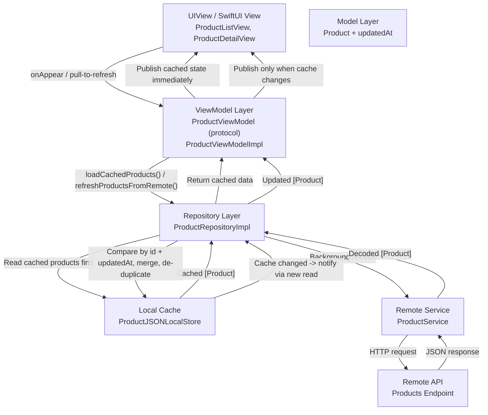
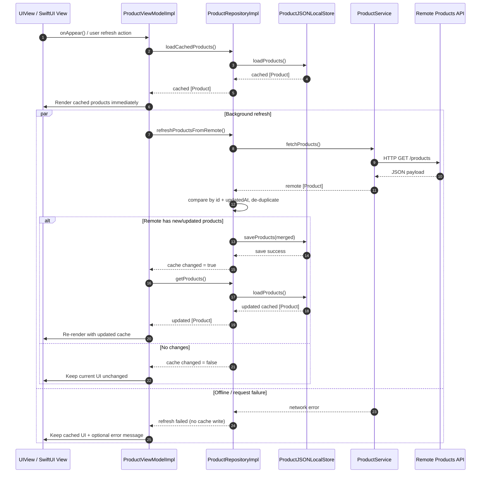
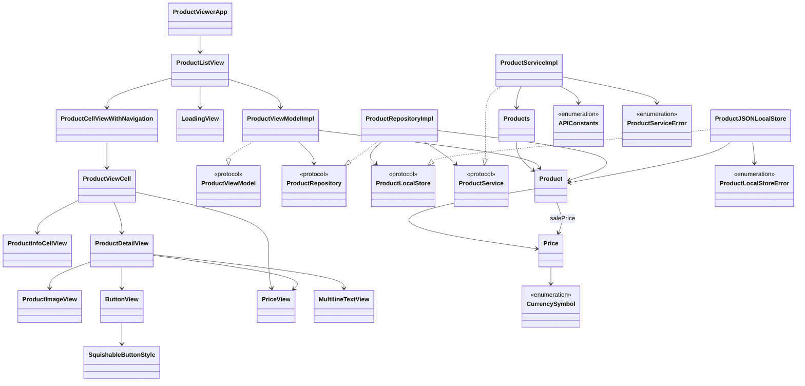

# ProductViewer

A SwiftUI sample app that displays a list of products with detail views, demonstrating modern Swift patterns like async/await networking, MVVM, custom styling, and accessibility.

## Features

- SwiftUI interface with product list and detail views
- MVVM architecture (`ProductViewModel`, `ProductViewModelImpl`)
- Async/await data loading via `ProductService.fetchProducts()`
- Reusable UI components:
  - `ButtonView` with a custom `SquishableButtonStyle`
  - `ProductViewCell` and `ProductCellViewWithNavigation`
- Design helpers:
  - `Color` extensions (`lightBlack`, `random`)
  - Currency symbol handling via `CurrencySymbol`
- Navigation with `NavigationLink` and hidden row separators for a clean look
- Accessibility identifiers on key controls (e.g., Add to Cart / Add to List buttons)

## Screenshots

Add screenshots or GIFs here to showcase the product list and detail flows.

## Requirements

- Xcode 14 or later
- iOS 15 or later
- Swift 5.5+ (async/await)

## Getting Started

1. Open the Xcode project/workspace in the repository.
2. Build and run the app on an iOS simulator or device.
3. The app will load products asynchronously and present them in a list. Tap a product to see its details.

## Architecture

- Models: `Product` (and related types)
- Views: SwiftUI views for list, cells, and detail screens
- ViewModels: `ProductViewModel` protocol and `ProductViewModelImpl` implementation
- Repository: `ProductRepository` and `ProductRepositoryImpl` (cache-first orchestration)
- Local store: `ProductJSONLocalStore` (Codable JSON cache for offline support)
- Remote service: `ProductService` provides `fetchProducts()`
- Freshness: `Product.updatedAt` is used to decide whether remote data is newer

Data flow:

- `View` never calls the network directly; it only interacts with the `ViewModel`.
- `ViewModel` always renders local cache first for fast startup and offline support.
- `Repository` fetches remote data in the background and merges by `id` + `updatedAt`.
- Local cache is the source of truth for UI updates; UI refreshes only when cache changes.
- Duplicate products are prevented by de-duplication during merge.
- If offline, cached data still renders and refresh failures are handled gracefully.

Sequence flow (request/response over time):

Entity diagram (classes, structs, enums, and relationships):

Interview walkthrough (quick talking points):

- "The `View` stays thin: it only captures user intent and renders state."
- "`ProductViewModelImpl` orchestrates cache-first loading through `ProductRepository`."
- "UI renders local data first, then remote refresh runs in the background."
- "`ProductRepositoryImpl` merges by `id` + `updatedAt`, and avoids duplicates."
- "`ProductJSONLocalStore` is the UI source of truth, enabling offline support."
- "`ProductService` remains isolated for network calls and easy mocking in tests."
- "The UI updates only when the local cache actually changes."

## Offline Behavior

Use the following QA checklist to validate cache-first and offline support:

1. **Prime cache (online setup)**
   - Launch the app with internet enabled.
   - Wait for products to load.
   - Kill the app from the app switcher.

2. **Warm launch in Airplane Mode**
   - Enable Airplane Mode.
   - Reopen the app.
   - Expected: product list appears immediately from local cache.
   - Expected: no crash; optional non-blocking refresh error message may appear.

3. **Cold launch in Airplane Mode (no cache)**
   - Delete the app (or clear simulator data) to remove local cache.
   - Keep Airplane Mode enabled.
   - Launch the app.
   - Expected: no stale/duplicate items.
   - Expected: empty/loading state with graceful error handling (no crash).

4. **Return online after offline usage**
   - Disable Airplane Mode.
   - Pull to refresh.
   - Expected: app fetches remote data, merges by `id` + `updatedAt`, updates cache.
   - Expected: UI changes only if cache content actually changed.

5. **Pull-to-refresh expectations**
   - Online with unchanged backend data: list remains visually unchanged.
   - Online with changed backend data: updated/new products appear once cache is written.
   - Offline: existing cached list stays visible; refresh failure is handled gracefully.
