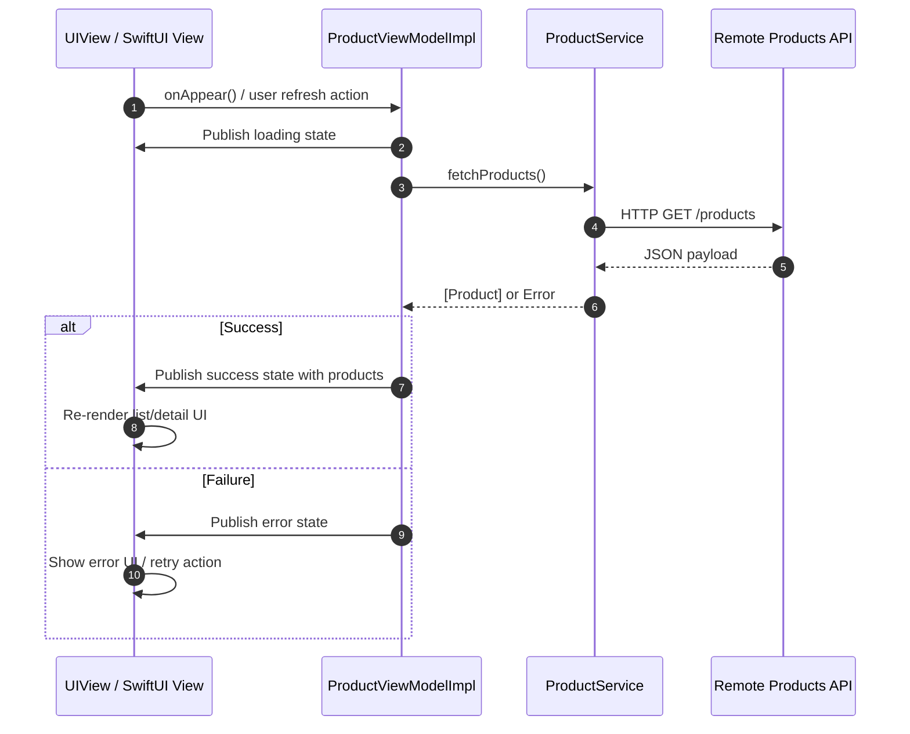

# ProductViewer

A SwiftUI sample app that displays a list of products with detail views, demonstrating modern Swift patterns like async/await networking, MVVM, custom styling, and accessibility.

## Features

- SwiftUI interface with product list and detail views
- MVVM architecture (`ProductViewModel`, `ProductViewModelImpl`)
- Async/await data loading via `ProductService.fetchProducts()`
- Reusable UI components:
  - `ButtonView` with a custom `SquishableButtonStyle`
  - `ProductViewCell` and `ProductCellViewWithNavigation`
- Design helpers:
  - `Color` extensions (`lightBlack`, `random`)
  - Currency symbol handling via `CurrencySymbol`
- Navigation with `NavigationLink` and hidden row separators for a clean look
- Accessibility identifiers on key controls (e.g., Add to Cart / Add to List buttons)

## Screenshots

Add screenshots or GIFs here to showcase the product list and detail flows.

## Requirements

- Xcode 14 or later
- iOS 15 or later
- Swift 5.5+ (async/await)

## Getting Started

1. Open the Xcode project/workspace in the repository.
2. Build and run the app on an iOS simulator or device.
3. The app will load products asynchronously and present them in a list. Tap a product to see its details.

## Architecture

- Models: `Product` (and related types)
- Services: `ProductService` provides `fetchProducts()` to load the product list
- ViewModels: `ProductViewModel` protocol and `ProductViewModelImpl` implementation
- Views: SwiftUI views for list, cells, and detail screens

Data flow:

```mermaid
flowchart TD
    A[UIView / SwiftUI View\nProductListView, ProductDetailView]
    B[ViewModel Layer\nProductViewModel(protocol)\nProductViewModelImpl]
    C[Service / Network Layer\nProductService]
    D[Remote API\nProducts Endpoint]
    E[Model Layer\nProduct]

    A -->|User actions\n(onAppear, refresh, tap)| B
    B -->|Requests data\nfetchProducts()| C
    C -->|HTTP request| D
    D -->|JSON response| C
    C -->|Decode response| E
    E -->|Mapped products| B
    B -->|Published state update\nloading / success / error| A
```

- `UIView/SwiftUI View` sends user intents to the `ViewModel`.
- `ViewModel` coordinates business logic and calls `ProductService`.
- `ProductService` fetches and decodes remote data into `Product` models.
- `ViewModel` publishes updated state, and the `View` re-renders accordingly.

Sequence flow (request/response over time):



Interview walkthrough (quick talking points):

- "The `View` stays thin: it only captures user intent and renders state."
- "`ProductViewModelImpl` is the orchestration layer, so UI code has no networking logic."
- "The ViewModel publishes `loading`, `success`, and `error`, which keeps rendering predictable."
- "`ProductService` owns API communication and decoding, so it is easy to mock in tests."
- "Models (`Product`) are passed back to the ViewModel, then transformed into UI-ready state."
- "This separation improves testability, maintainability, and the ability to swap implementations."
